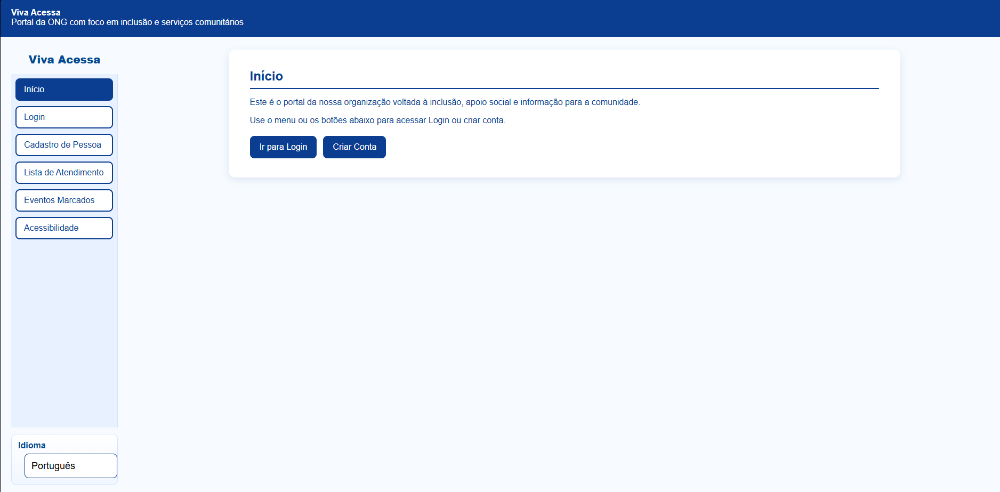
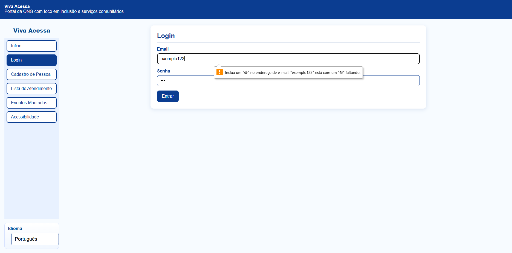

# Inclui+

Projeto desenvolvido com foco em acessibilidade, inclusão digital e organização de informações para ONGs que atendem pessoas com deficiência.

O sistema foi criado para auxiliar no gerenciamento de atendimentos, comunicação com responsáveis, organização de eventos e divulgação de ações sociais de forma simples e acessível.

---

## Objetivo

Desenvolver uma plataforma WEB intuitiva e acessível para melhorar a comunicação e o gerenciamento interno da instituição, oferecendo uma experiência mais eficiente para usuários, responsáveis e voluntários.

---

## Funcionalidades

- Sistema de login;
- Cadastro de usuários e responsáveis;
- Gerenciamento de eventos;
- Área de comunicados;
- Navegação entre páginas;
- Recursos de acessibilidade;
- Interface responsiva e intuitiva.

---

## Recursos de Acessibilidade

- Ajuste de tamanho de fonte;
- Alto contraste;
- Navegação por teclado;
- Interface adaptada para diferentes usuários;
- Layout responsivo;
- Linguagem simples e acessível.

---

## Tecnologias Utilizadas

- HTML5
- CSS3
- JavaScript
- VS Code
- GitHub Pages

---

## Acesso ao Projeto

🔗 Link do site publicado:

https://gugazx.github.io/Viva-Acessa/

---

## Imagens do Projeto

---

## Benefícios do Projeto

- Melhor organização da ONG;
- Inclusão digital;
- Facilidade de acesso às informações;
- Comunicação mais eficiente;
- Melhor experiência para usuários e responsáveis.

---

## Publicação

Projeto publicado utilizando GitHub Pages e armazenado no GitHub.
